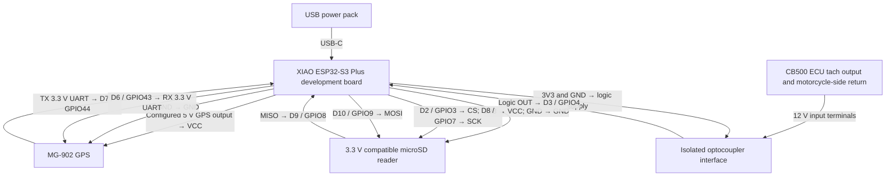

# RaceSync XIAO ESP32-S3 Plus wiring schematic

This schematic describes the `board/xiao-esp32-s3-plus` firmware pin map with the development board's GPS power output configured to 5 V. Verify the physical board's power output and the particular SD and optocoupler modules before connecting them. The XIAO hardware remains in bench development.

| Function | Development board connection | Peripheral connection |
| --- | --- | --- |
| GPS power | Configured 5 V GPS output; GND | MG-902 VCC; GND |
| GPS data to logger | D7 / GPIO44 (RX) | MG-902 TX (3.3 V UART) |
| GPS configuration to receiver | D6 / GPIO43 (TX) | MG-902 RX (3.3 V UART) |
| SD power | 3V3; GND | Compatible SD reader VCC; GND |
| SD SPI | D2 / GPIO3; D8 / GPIO7; D10 / GPIO9; D9 / GPIO8 | CS; SCK; MOSI; MISO, respectively |
| RPM input | D3 / GPIO4 | Optocoupler logic OUT (0–3.3 V) |
| RPM interface logic power | 3V3; GND | Optocoupler logic VCC; GND |
| RPM motorcycle-side input | No direct XIAO connection | ECU tach signal and appropriate return to isolated 12 V input terminals |

The firmware configures D3/GPIO4 with an input pull-up and counts falling edges. Confirm that the selected optocoupler produces falling pulses limited to 0–3.3 V. Keep the motorcycle-side tach wiring isolated from the logic-side ground; follow the actual optocoupler module's terminal labels. Never connect the ECU tach signal directly to the XIAO.

The MG-902 specification calls for a 5 V supply while its UART output is 3.3 V LVTTL. Do not confuse its supply voltage with its serial logic voltage. Confirm that the specific SD reader runs on 3.3 V supply and logic before using the XIAO 3V3 rail. D0/GPIO1 remains reserved for the 3.3 V throttle sensor; D4/GPIO5 and D5/GPIO6 remain available as the planned I2C bus.

Sources: [`include/Pins.h`](../include/Pins.h), [`README.md`](../README.md), and [MicoAir MG-902 specifications](https://micoair.com/gps_mg-902/).
